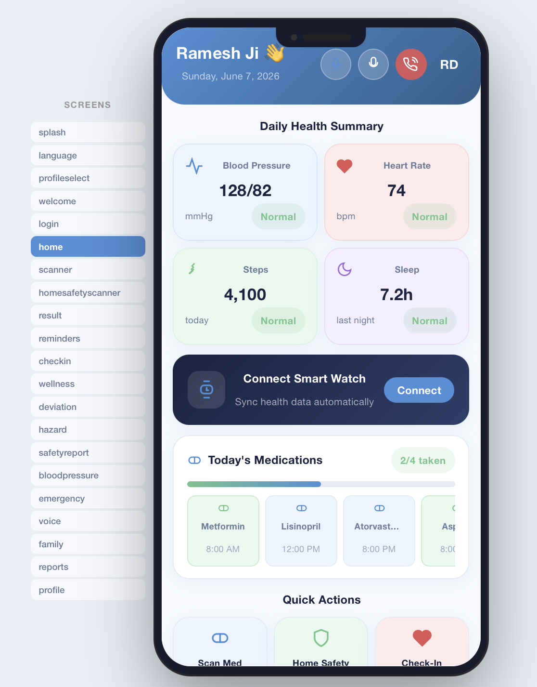
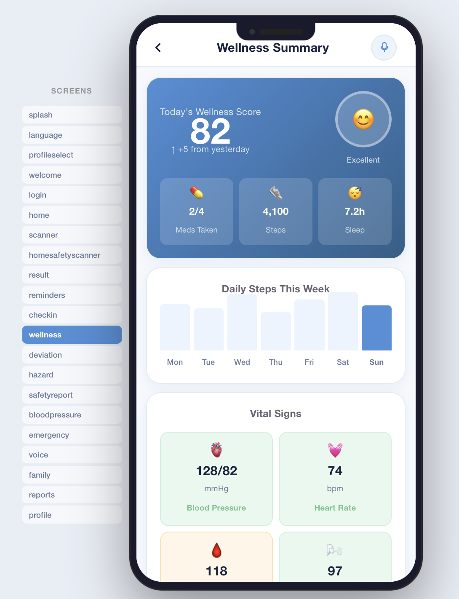
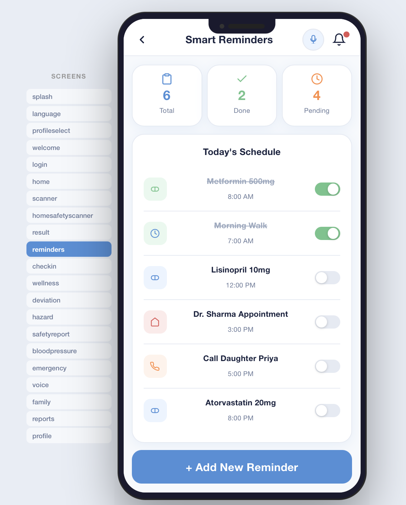
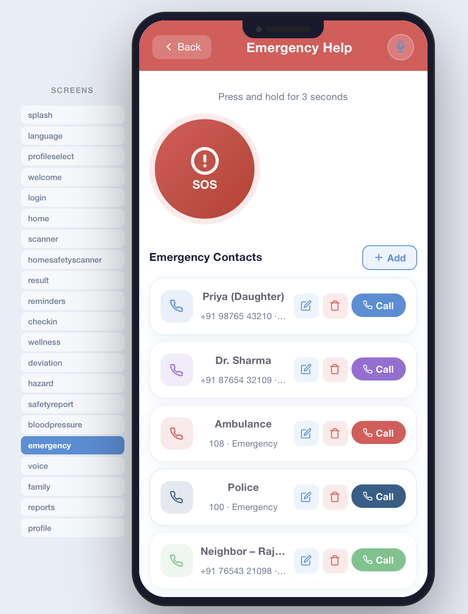
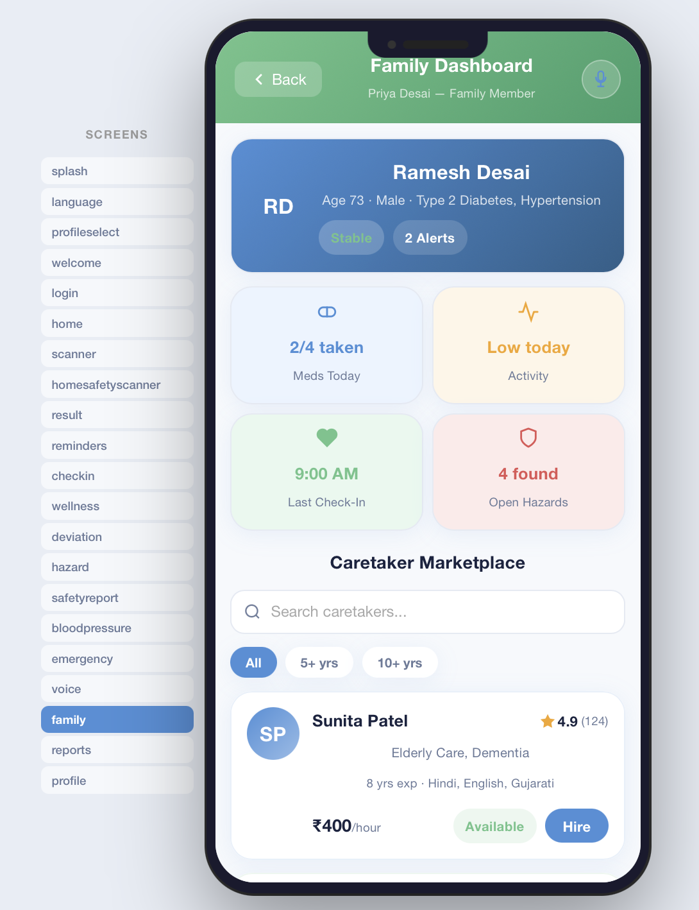
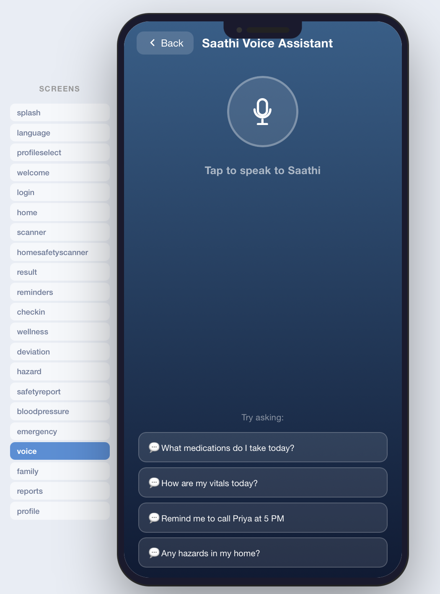
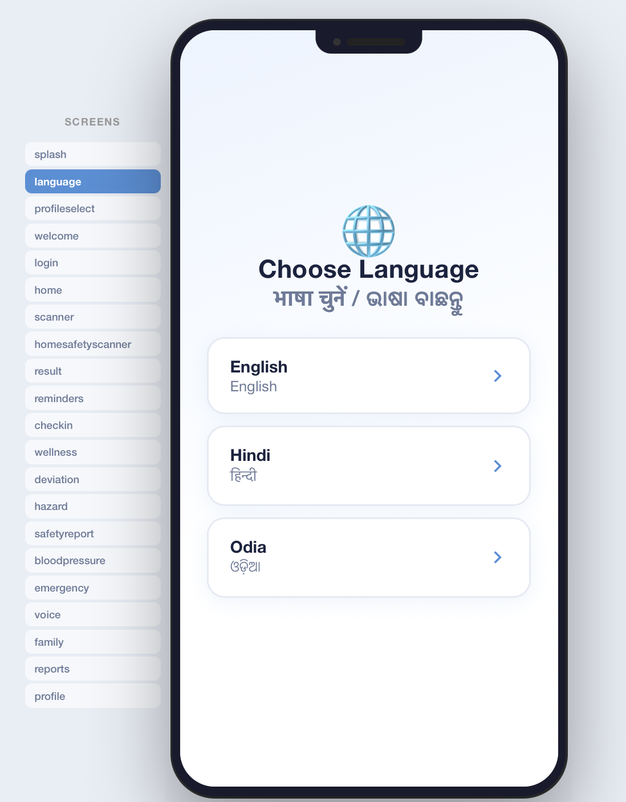
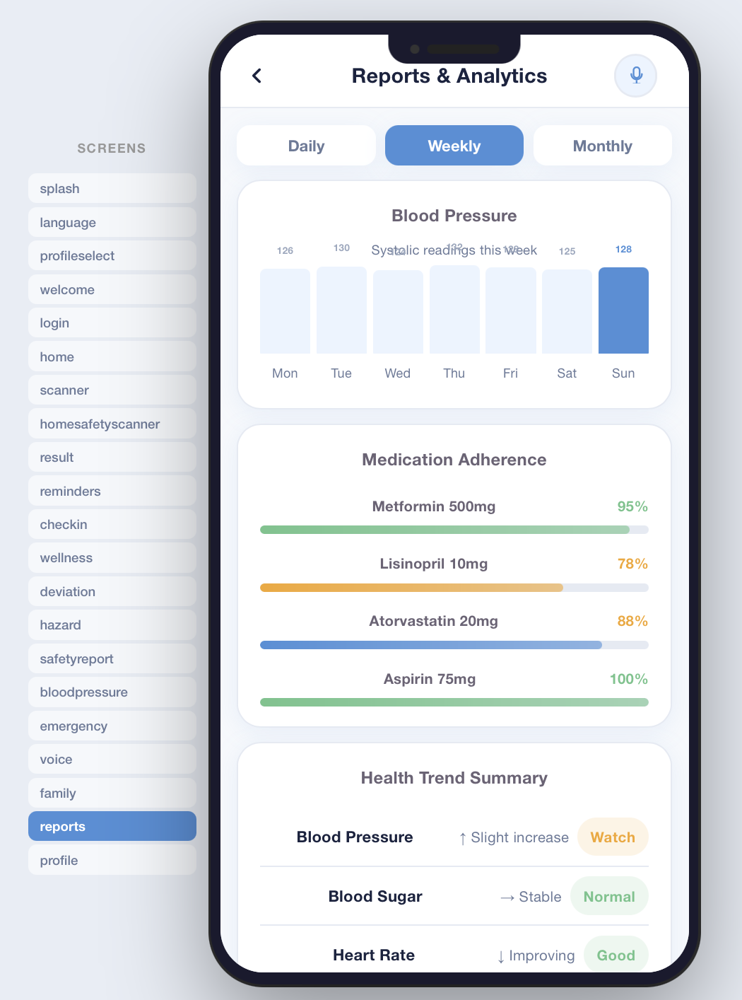

# Saathi – Smart Elderly Care & Health Monitoring Platform

Saathi is a full-stack healthcare platform designed to improve the safety, health, and independence of senior citizens by providing medication management, health monitoring, emergency assistance, caregiver connectivity, multilingual support, and voice-enabled accessibility through an intuitive web interface.

---

## Features

- 20+ interactive screens for elderly healthcare management
- Role-based dashboards for Senior and Family users
- Medication reminder and medicine management system
- Health dashboard with personalized health reports
- Emergency SOS assistance with emergency contact management
- Home safety monitoring
- Family & caregiver connectivity
- Voice-enabled navigation using the Web Speech API
- Multilingual support (English, Hindi, and Odia)
- Smartwatch connectivity simulation
- RESTful API backend for user preferences and emergency contacts
- Hybrid data persistence using Express REST APIs with automatic browser localStorage fallback

---

## Application Screenshots

| Home | Health Dashboard |
|------|------------------|
|  |  |

| Medication Reminders | Emergency SOS |
|----------------------|---------------|
|  |  |

| Family Dashboard | Voice Navigation |
|------------------|------------------|
|  |  |

| Multilingual Support | Health Reports |
|----------------------|----------------|
|  |  |

---

## Tech Stack

### Frontend
- React.js
- JavaScript
- HTML
- CSS

### Backend
- Node.js
- Express.js
- RESTful APIs

### APIs & Browser Features
- Web Speech API (Speech Recognition & Speech Synthesis)
- Browser Local Storage

### Data Storage
- JSON-based Data Persistence

---

## Project Structure

```text
Saathi-Elderly-Care-Platform/
├── public/
├── src/
│   ├── assets/
│   ├── App.jsx
│   ├── App.css
│   ├── index.css
│   └── main.jsx
├── server/
│   ├── server.js
│   ├── package.json
│   ├── package-lock.json
│   └── data.json
├── package.json
├── package-lock.json
├── vite.config.js
├── eslint.config.js
├── index.html
└── README.md
```

---

## Installation & Setup

### Clone the repository

```bash
git clone https://github.com/LuminaM230/Saathi-Elderly-Care-Platform.git
cd Saathi-Elderly-Care-Platform
```

### Install Frontend Dependencies

```bash
npm install
```

### Start the Frontend

```bash
npm run dev
```

### Start the Backend

```bash
cd server
npm install
npm start
```

The frontend runs on **http://localhost:5173** and the backend runs on **http://localhost:4000**.

---

## Key Highlights

- Engineered a healthcare platform with 20+ interactive screens for senior citizens and caregivers.
- Built RESTful APIs with CRUD operations for emergency contacts and user preferences.
- Implemented multilingual support across English, Hindi, and Odia.
- Developed voice-enabled navigation using the Web Speech API.
- Designed role-based dashboards for Senior and Family users.
- Integrated browser localStorage fallback to ensure uninterrupted functionality when the backend is unavailable.
- Implemented medication reminders, emergency assistance, home safety monitoring, health reports, and caregiver connectivity.

---

## Future Enhancements

- MongoDB/PostgreSQL integration
- Secure user authentication and authorization
- AI-powered health insights
- Real-time wearable device integration
- Video consultation with caregivers and doctors
- Push notifications for reminders and emergency alerts

---

## Developed During

Originally built for a hackathon and later extended into a full-stack healthcare platform.

---

## Project Status

Completed as a full-stack healthcare platform featuring a React frontend, Express.js backend, RESTful APIs, multilingual support, and voice-enabled accessibility.

---

## Acknowledgements

This project was initially developed during a hackathon and later enhanced into a full-stack healthcare platform with additional backend functionality, REST APIs, improved accessibility features, and persistent data storage.
